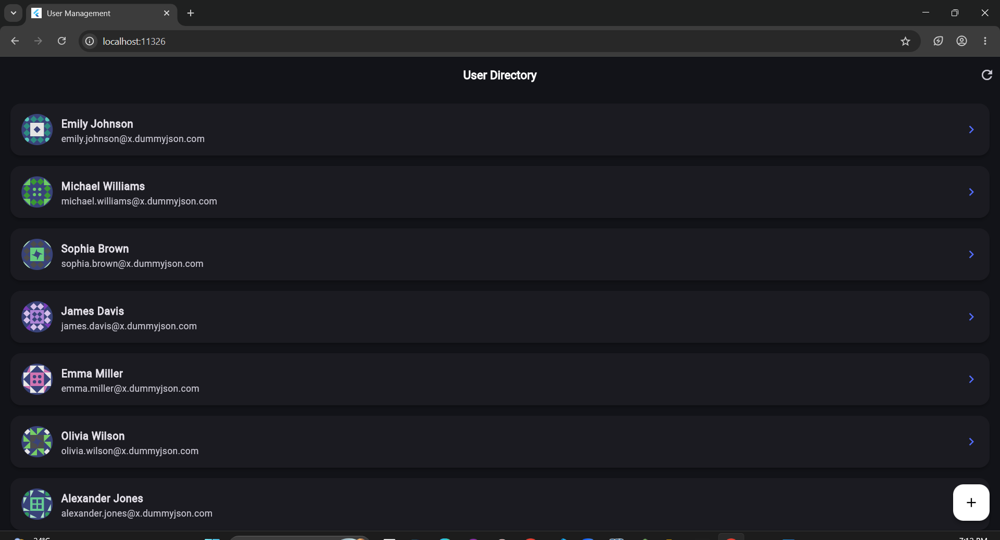
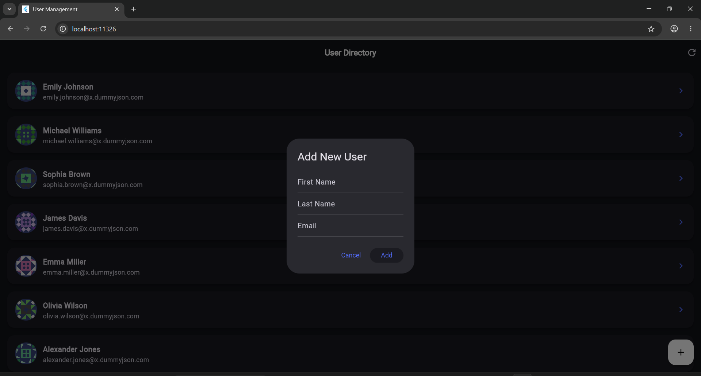
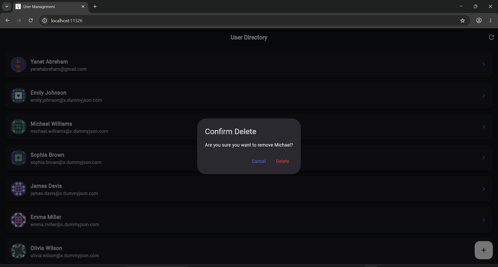

# CRUD API Consumption using HTTP and Provider State Management

A clean, scalable, and responsive Flutter user management application built using modern Flutter architecture principles. This project demonstrates professional separation of concerns through Provider state management and RESTful API integration using the HTTP package.


🚀 Overview

This application connects to the DummyJSON API to perform full CRUD (Create, Read, Update, Delete) operations on user data. It showcases reactive UI updates, structured business logic handling, and efficient asynchronous networking using the Provider pattern.

The architecture focuses on maintainability, scalability, and production-style code organization.

 🛠️ Tech Stack & Architecture

**Framework:** Flutter  
**State Management:** Provider – Used for centralized and reactive state management.  
**Networking:** HTTP – Handles GET, POST, PATCH, and DELETE requests for API communication.  
**Architecture Pattern:** Provider-Based State Management  
**Data Modeling:** Custom Dart model classes with JSON serialization.  

✨ Key Features

**Live API Integration:**  Automatically fetches users from a remote REST API on startup.  
**Reactive State Management:**  Uses `ChangeNotifier`, `Provider`, and `Consumer` for dynamic UI rebuilding.  
**Full CRUD Operations:**  Supports creating, updating, deleting, and retrieving users.  
**Responsive UI Updates:**  Keeps the interface synchronized with application state changes.  
**Structured Error Handling:**  Handles API failures, invalid responses, and loading states cleanly.  
**Scalable Architecture:**  Organized layers for maintainable and production-ready development.  

📱 Application Demo & Previews

🔍 Interactive User Directory (Fetch State)

The main dashboard consumes API data through Provider state updates, dynamically rendering reusable user profile components.



⚡ CRUD Lifecycle Workflows

| ➕ Create User Profile | 🆕 Created User Result |
|---|---|
| **Validated Inputs:** Uses structured form validation before dispatching provider update methods. | **Live UI Update:** Newly created users instantly appear in the interface through reactive Provider state updates. |
|  |  |

| ⚙️ Edit or Delete Action Bar | 🗑️ Delete Confirmation |
|---|---|
| **Contextual Actions:** Provides edit and delete operations through a clean modal interaction system. | **Protected Actions:** Prevents accidental removals using confirmation dialogs before deletion. |
|  |  |

| 🚀 Swipe-to-Delete Interaction |
|---|
| **Smooth Native UX:** Uses `Dismissible` widgets integrated with Provider state updates for instant visual feedback. |
|  |

---

## 📂 Project Structure

```text
lib/
├── models/
│   └── user.dart
│
├── providers/
│   └── user_provider.dart
│
├── services/
│   └── api_service.dart
│
├── screens/
│   └── home_screen.dart
│
└── main.dart
```

📋 Requirements

- Flutter SDK
- Dart SDK
- Android Studio or VS Code
- Emulator or Physical Device

📦 Main Dependencies

```yaml
provider: ^6.1.1
http: ^1.1.0
```

🔧 How to Run

Follow these steps to get the project running on your local machine:

```bash
# 1. Clone the repository
git clone https://github.com/Yanet-Abreham/flutter-http-provider-crud.git

# 2. Navigate into the project folder
cd flutter-http-provider-crud

# 3. Install dependencies
flutter pub get

# 4. Run the application
flutter run
```
